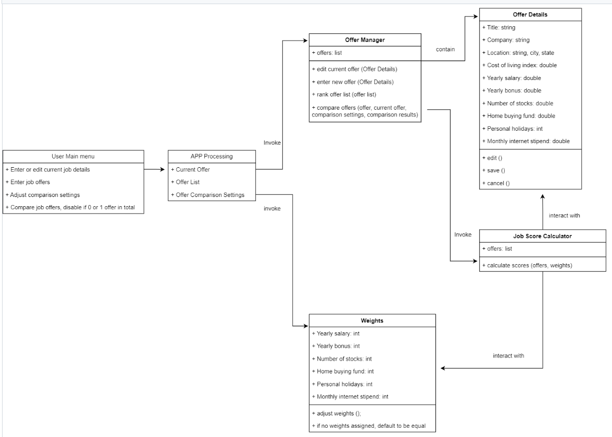
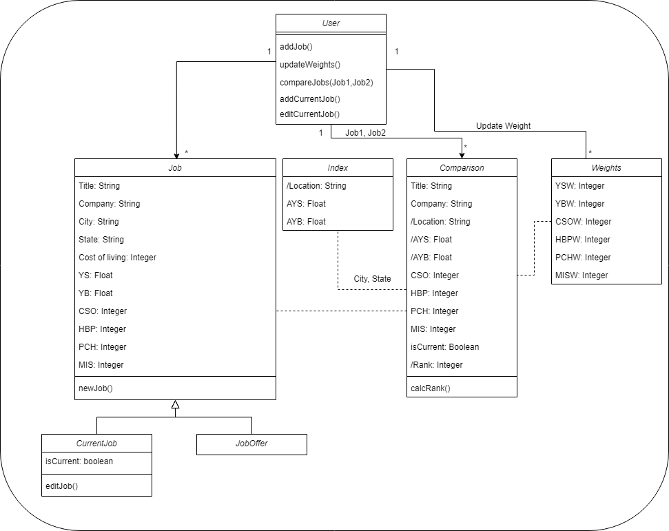
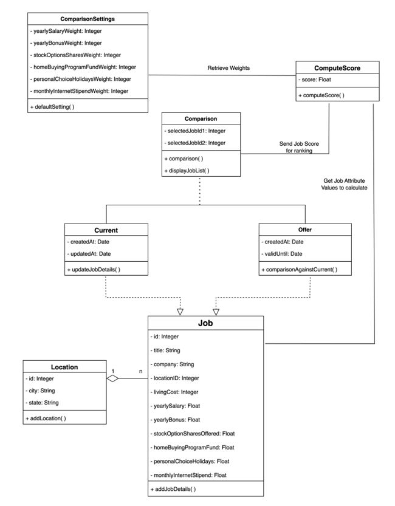
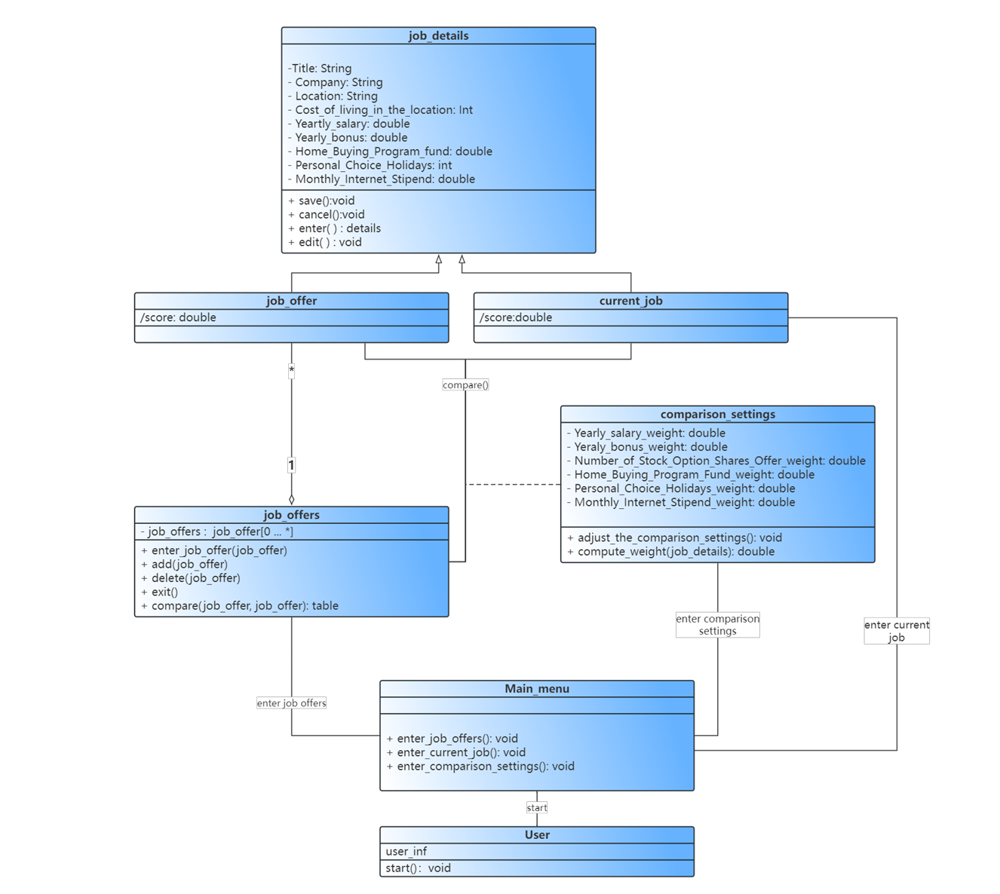
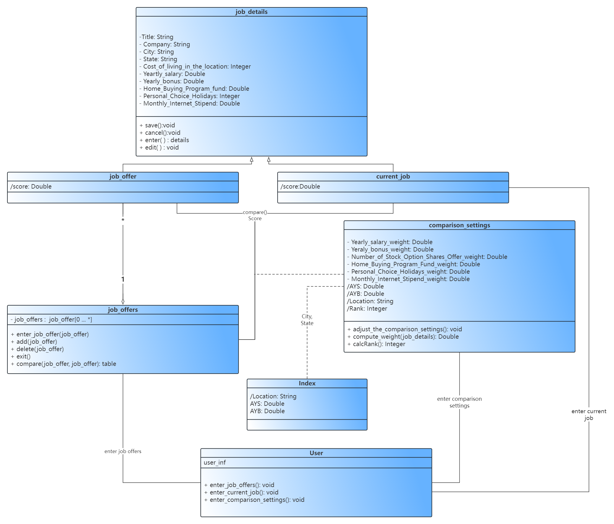

# Individual Designs

## Design 1 (Haoran He)

Based on group discussion, 

main pros: 
1. fulfill the assignment requirements
2. include the `rank offer list` function

main cons: 
1. `User Main Menu` not necessary
2. `Job Score Calculator` can be embedded in `Offer Manager`
3. does not have location id

## Design 2 (Sharma, Jayesh R)

Based on group discussion, 

main pros:
1. Takes location Index into consideration by implementing Index class for AYS and AYB calculation
2. Takes comparison class into consideration for computing Rank and displaying comparison

main cons:
1. Fails to capture order of ranked jobs when user chooses compare job option and instead computes rank for selected jobs

## Design 3 (Thong, Jing Lin)

Based on group discussion, 

main pros:
1. Design included a ComputeScore function to facilitate the ranking of the job offers
2. Abstracted out the Location class to allow facilitate easy maintenance of entries for city and state.

main cons:
1. Assumed only a single user, so there is a missing User class unlike the other 3 designs

## Design 4 (Liu, Moyang)

Based on group discussion, 

main pros:
1. Designed the job_offers class, where the attribute is a list of job_offer data types, which is more in line with the actual situation.
2. Logic and consistency: this design shows a good logic and consistency. It is able to establish clear association and hierarchical structures, so that the various parts of the system cooperate with each other.
3. Maintainability and Scalability: This design takes into account the maintainability and scalability of the system. It considered future changes in requirements and presented an extensible design structure in UML diagrams. Added some necessary functions that are not included in the requirements, such as adding and deleting job offers and editing current jobs.
   
main cons:
1. The main menu class is not necessary.
2. Not considering the ranking function.
3. Location class should be added.

# Team Design

Based on group discussion, we agreed to use Design 4 as our base diagram and modified based on group members' feedback. The common features between team design and individual designs include job details, job offer class, current offer class, job offers list, comparison settings. The difference between team design and individual designs include ranking function, location index and user main menu class. After discussion, we agreed to add ranking function, location index and remove user main menu. After adjustment, the current team design present better logic and fulfills the assignment requirements.

# Summary

Throughout our discussions and collaborative efforts on the project's design, our team has gained insights that extend beyond teamwork and UML design. One important lesson is the significance of user-centric approach in the design that could be ignored to some extent. For example, automate ranking the job offer list when job offer detail and comparison settings are available is a nice function to be implemented, yet was neglected in some individual designs. This project underscores the importance of teamwork and effective communication. Group members' feedback facilitates exchange of ideas and enriches the design process and outcome.