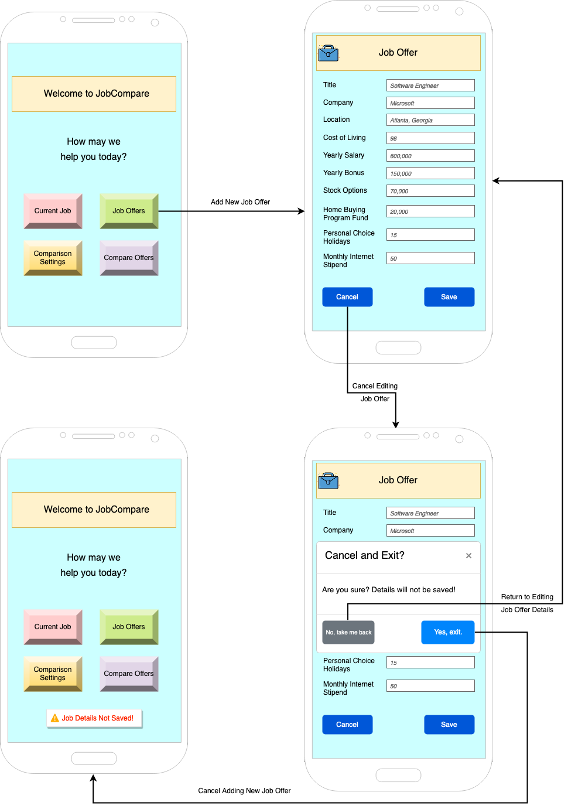

# Design Document

<!-- *This is the template for your design document. The parts in italics are concise explanations of what should go in the corresponding sections and should not appear in the final document.* -->

**Author**: \<Team030>

## 1 Design Considerations

<!-- *The subsections below describe the issues that need to be addressed or resolved prior to or while completing the design, as well as issues that may influence the design process.* -->

### 1.1 Assumptions

<!-- *Describe any assumption, background, or dependencies of the software, its use, the operational environment, or significant project issues.* -->
**Background**: User should have all the detailed information for each job offer prior to entering the details in the APP.  
**Operational Environment**: The app is assumed to be used on smartphones. The operating system primarily targeted is Android.  
**Dependency**: The app's functionality depends on accurate cost of living indices from the sources.  

### 1.2 Constraints

<!-- *Describe any constraints on the system that have a significant impact on the design of the system.* -->
1. Use of database to persist Job Offer and Current job data.  
2. External API call to fetch Index based on City and State.  

### 1.3 System Environment

<!-- *Describe the hardware and software that the system must operate in and interact with.* -->
The application runs on Andorid runtime envrionment.  

## 2 Architectural Design

<!-- *The architecture provides the high-level design view of a system and provides a basis for more detailed design work. These subsections describe the top-level components of the system you are building and their relationships.* -->

The above images showcases a high level architectural design of our job comparison application which has 3 major components listed below,
**1. Application:**  
    The user interacts with application via a user interface provided by the app on his/her smartphone.  
**2. Database:**   
    The application connects to a database to persist user's job offer data and save the state of the application.  
**3. API calls:**  
    The application makes an API call over the internet to fetch Index for given City and State.  

### 2.1 Component Diagram

<!-- *This section should provide and describe a diagram that shows the various components and how they are connected. This diagram shows the logical/functional components of the system, where each component represents a cluster of related functionality. In the case of simple systems, where there is a single component, this diagram may be unnecessary; in these cases, simply state so and concisely state why.* -->

Components include:
1. User
2. Job Offers 
3. Comparison Settings 
4. Index
5. Job Offer
6. Current Offer
7. Job Details  
The component diagram consists of three main components: User, DataBase, and Compare.  
First, the DataBase component contains job offers and current job components that provide job details interfaces to external parties.  
Next, the compare component includes the index component and the comparison settings component, where the index component provides the AYS and AYB interfaces for the comparison settings component. The comparison settings component obtains the user adjust interface and job details interface, and provides the score and rank interfaces to external parties.  
Lastly, the user component provides a location interface to interact with the index component. It provides an edit interface to interact with job offers and current job components. It also provides an Add/Delete interface to interact with the job offers component. At the same time, through the job details interface, the user component can be obtained through the enter job offers and enter current job.  

### 2.2 Deployment Diagram

<!-- *This section should describe how the different components will be deployed on actual hardware devices. Similar to the previous subsection, this diagram may be unnecessary for simple systems; in these cases, simply state so and concisely state why.* -->

The above diagram gives an overview from deployment perspective of an Android application. It deals with below mandatory components included in android application development,

1. DEX (Dalvik Executable):
    The DEX file contains bytecode that can be efficiently executed by the Dalvik or Android Runtime (ART) virtual machine on Android devices.

2. ARSC (Android Resource):
    Resources such as images, layouts, strings, and other assets used by the Android app are compiled and stored in the ARSC file.

3. Res (Resources):
    The res directory in an Android application files contains various resources used by the application, including XML files, layout files, images, strings, and other assets.

4. Manifest.xml (AndroidManifest.xml):
    This file includes information such as the app's package name, version code, version name, permissions required, activities, services, broadcast receivers, and other components, acting as a blueprint for the Android system to understand how to interact with and manage the app.

## 3 Low-Level Design

<!-- *Describe the low-level design for each of the system components identified in the previous section. For each component, you should provide details in the following UML diagrams to show its internal structure.* -->

### 3.1 Class Diagram

<!-- *In the case of an OO design, the internal structure of a software component would typically be expressed as a UML class diagram that represents the static class structure for the component and their relationships.* -->
Here we use our team design for Deliverable 1

### 3.2 Activity Diagram
#### 3.2.1 Activity Diagram of job offers activities

#### 3.2.2 Activity Diagram of current job activities

#### 3.2.3 Activity Diagram of compare activity

<!-- *<u>Optionally</u>, you can decide to describe some dynamic aspects of your system using one or more behavioral diagrams, such as sequence and state diagrams.* -->

## 4 User Interface Design
<!-- *For GUI-based systems, this section should provide the specific format/layout of the user interface of the system (e.g., in the form of graphical mockups).* -->

### 4.1 Mockups

This section contains all the individual wireframes from which the scenarios will be based on.

#### 4.1.1 Main Menu

This mockup illustrates the main menu of the mobile app, where the user can be directed to other functionalities such as entering/editing current job details, entering job offers, adjusting comparison settings and comparing job offers.

**NOTE**: In all other pages, the _Briefcase_ icon in the banner at the top of the page will bring the user back to the Main Menu page.

#### 4.1.2 Initial Page for Current Job Details, for 1st-time Entry

This mockup illustrates the initial view in the case when the user clicks on the _Current Job_ button from the Main Menu in Section 4.1.1, but has not entered any initial current job details, and there is no record for current job. The _Back_ button will bring the user back to the Main Menu, while the _Proceed_ button will bring the user to the interface for entering current job details.

#### 4.1.3 Initial Page for Current Job Details, when Current Job Details are available

This mockup illustrates the view in the case the user had previously entered current job details. In this image, we can see the details that were previously keyed in are in read-only fields. The _Edit_ button will bring the user to the interface for editing the current job details.

#### 4.1.4 Enter or Edit Current Job Details

This mockup illustrates the view when the user wishes to enter (for 1st time entry) or edit the current job details. Here, all the fields are now editable and contain placeholder text to guide the user in entering data. The placeholder text will also be in italics. The _Save_ button will allow users to save the entered details, while the _Cancel_ button will allow the user to cancel and exit without saving.

#### 4.1.5 Cancel and Exit Without Saving Current Job Details

This mockup illustrates the view when the user clicks on the _Cancel_ button from Section 4.1.4, which will prompt the user if it is confirmed to cancel and exit without saving current job details. On this popup, the user will be prompted to confirm exit or return to the current page to carry on editing the details.

* If the user proceeds to click the button _"Yes, exit"_, the user will be brought back to the Main Menu, with a warning toast appearing at the bottom of the screen.

* However, if the user proceeds to click the button _"No, take me back"_, the user will be brought back to the Enter/Edit Current Job Details page.

#### 4.1.6 Saved Current Job Details

This mockup illustrates the view when the user clicks on the _Save_ button from Section 4.1.4, where the current job details will be saved. The user will be brought back to the Main Menu, with a success toast appearing at the bottom of the screen.

#### 4.1.7 New Job Offer Details

This mockup illustrates the view when the user clicks on the _Job Offers_ button from the Main Menu in Section 4.1.1, where the user can be allowed to enter details of a new job offer. The details to be entered for the job offer is the same as that of the current job, though the banner displayed is different and reflects as _"Job Offer"_ instead of _"Current Job"_.

#### 4.1.8 Save Job Offer Details

This mockup illustrates the view when the user clicks on the _Save_ button from Section 4.1.7, where the user will be allowed to save details of a new job offer. Here, the user will be presented 2 buttons, _"Enter Another Offer"_ which allows the user to key in another job offer, and _"Compare Against Current"_ which allows the user to compare the saved job offer against the current job, if present.

#### 4.1.9 Cancel and Exit without Saving Job Offer Details

This mockup illustrates the view when the user clicks on the _Cancel_ button from Section 4.1.7, which will prompt the user if it is confirmed to cancel and exit without saving job offer details. On this popup, the user will be prompted to confirm exit or return to the current page to carry on editing the details.

* If the user proceeds to click the button _"Yes, exit"_, the user will be brought back to the Main Menu, with a warning toast appearing at the bottom of the screen.

* However, if the user proceeds to click the button _"No, take me back"_, the user will be brought back to the Job Offer page.

#### 4.1.10 Initial Page for Comparison Settings, for 1st-time Entry

This mockup illustrates the initial view in the case when the user clicks on the _Comparison Settings_ button from the Main Menu in Section 4.1.1, but has not entered any initial current comparison settings. The _Back_ button will bring the user back to the Main Menu, while the _Proceed_ button will bring the user to the interface for editing the weights for comparison. By default, all weights for all factors are initialised to 1, so each factor is given equal weight during comparison.

#### 4.1.11 Initial Page for Comparison Settings, when settings have been set

This mockup illustrates the view in the case the user had previously modified the weights in the comparison settings. In this image, we can see the settings that were previously keyed in are in read-only fields. The _Edit_ button will bring the user to the interface for editing the weights for the different factors.

#### 4.1.12 Edit Comparison Settings

This mockup illustrates the view when the user wishes to edit the comparison settings. Here, all the fields are now editable and contain placeholder text to guide the user in entering data. The placeholder text will also be in italics. The _Save_ button will allow users to save the entered details, while the _Cancel_ button will allow the user to cancel and exit without saving.

#### 4.1.13 Cancel and Exit Without Saving Comparison Settings

This mockup illustrates the view when the user clicks on the _Cancel_ button from Section 4.1.12, which will prompt the user if it is confirmed to cancel and exit without saving comparison settings. On this popup, the user will be prompted to confirm exit or return to the current page to carry on editing the details.

* If the user proceeds to click the button _"Yes, exit"_, the user will be brought back to the Main Menu, with a warning toast appearing at the bottom of the screen.

* However, if the user proceeds to click the button _"No, take me back"_, the user will be brought back to the Adjust Settings page.

#### 4.1.14 Saved Comparison Settings

This mockup illustrates the view when the user clicks on the _Save_ button from Section 4.1.12, where the comparison settings will be saved. The user will be brought back to the Comparison Settings page, with a success toast appearing at the bottom of the screen.

#### 4.1.15 Initial Page for Offer Comparison

This mockup illustrates the view in the case when the user clicks on the _Compare Offers_ button from the Main Menu in Section 4.1.1. Here, the user can view the title and company of all job offers, including the current job if present, ranked according to comparison score in decreasing order. Each field in the current job will be indicated with an asterisk (*) and underlined for easy identification. Furthermore, as all job offers are listed in a table form, color banding where alternate rows are given different colors, would be used for easy data visualization and scanning.

An additional "Select" column is provided for users to select job offers for comparison.

#### 4.1.16 Selection of 2 Offers (or a Job Offer with the Current Job)

This mockup illustrates the view in the case when the user selects 2 jobs from the table of offers in Section 4.1.15. All other jobs will have their corresponding "Select" checkbox disabled. The _Compare_ button will allow users to compare between the 2 jobs, while the _Cancel_ button will allow the user to cancel the comparison.

#### 4.1.17 Cancel and Exit Job Comparison

This mockup illustrates the view when the user clicks on the _Cancel_ button from Section 4.1.16, which will prompt the user if it is confirmed to cancel the job comparison. On this popup, the user will be prompted to confirm exit or return to the current page to carry on the job comparison.

* If the user proceeds to click the button _"Yes, exit"_, the user will be brought back to the Main Menu, with a warning toast appearing at the bottom of the screen.

* However, if the user proceeds to click the button _"No, take me back"_, the user will be brought back to the Compare Offers page.

#### 4.1.18 Table of Comparison between 2 Jobs

This mockup illustrates the view when the user clicks on either the _Compare_ button from Section 4.1.16, or the _"Compare Against Current"_ button in Section 4.1.8. Here, the user will be able to compare between all factors of the 2 selected jobs. The _Compare Again_ button will allow users to return to the Compare Offers page where the selections are cleared out so as to let the user re-select jobs for comparison, while the _Back_ button will allow the user to return to the previous page.

 

### 4.2 Scenarios/Workflow

#### Scenario 1: Save Current Job

#### Scenario 2: Cancel and Exit without Saving Current Job

#### Scenario 3: Save New Job Offer

#### Scenario 4: Cancel and Exit without Saving New Job Offer

#### Scenario 5: Save Comparison Settings

#### Scenario 6: Cancel and Exit without Saving Comparison Settings

#### Scenario 7: Comparison Offers 

