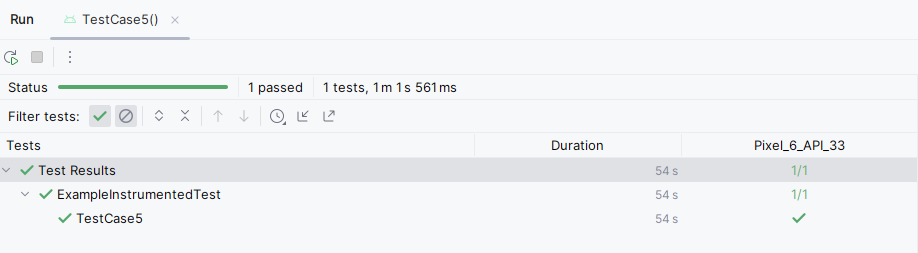

# Test Plan

<!-- *This is the template for your test plan. The parts in italics are concise explanations of what should go in the corresponding sections and should not appear in the final document.* -->

**Author**: \<Team030>

## 1 Testing Strategy

### 1.1 Overall strategy

<!-- *This section should provide details about your unit-, integration-, system-, and regression-testing strategies. In particular, it should discuss which activities you will perform as part of your testing process, and who will perform such activities.* -->
The testing strategy will focus on verifying the functionality, usability, reliability and accuracy of the application in line with the specified requirements. We will engage in unit testing to validate individual components in isolation, ensuring that each function behaves as expected.  Integration testing will ensure that the components work together seamlessly, particularly the flow between the main menu and the different functionalities (entering job details, entering job offers, adjusting comparison settings, and comparing job offers). System testing will validate the entire application's performance against the requirements. Regression testing will be conducted after any updates to ensure new changes do not affect existing functionalities.

### 1.2 Test Selection

<!-- *Here you should discuss how you are going to select your test cases, that is, which black-box and/or white-box techniques you will use. If you plan to use different techniques at different testing levels (e.g., unit and system), you should clarify that.* -->
White-box testing techniques will be employed to develop test cases for unit testing to ensure code logic is thoroughly tested. At the integration and system levels, we will rely on black-box testing techniques to validate the software against its requirements without considering the internal workings of the application. 

### 1.3 Adequacy Criterion

<!-- *Define how you are going to assess the quality of your test cases. Typically, this involves some form of functional or structural coverage. If you plan to use different techniques at different testing levels (e.g., unit and system), you should clarify that.* -->
Our adequacy criteria will involve covering unit testing level to ensure the correctness of the code. For integration and system testing, our criterion will be the complete execution of all functional test cases derived from the software requirements, ensuring all features work as intended. 

### 1.4 Bug Tracking

<!-- *Describe how bugs and enhancement requests will be tracked.* -->
Bug reporting and enchancements requests will be facilitated for the specified application via github repository which holds the open soruce code for this android application.

The following structure is to be followed to report, document and track a bug, 
1. Application Name/Version
2. Android OS version
3. Device/Model name
4. Description of bug report
5. Expected behavior vs. observed behavior
6. Steps to reproduce
7. Attach Screenshots (if captured)
8. Severity Level: (Minor, Major, Critical)
8. Request type: Bug Report

For enhancements requests the user needs to share below details,
1. Application Name/Version
2. Android OS version
3. Device/Model name
4. Description of Enhancement Request
5. Use Case Scenario
6. Priority Level: (Low, Medium, High)
7. Mockup Screenshots (if applicable)
8. Request type: Enhancement Request

### 1.5 Technology

<!-- *Describe any testing technology you intend to use or build (e.g., JUnit, Selenium).* -->
Technology to be used to automate test cases and produce results is going to be JUnit since it provides standardized approach for performing unit tests on android application and has a seamless integration with Android studio IDE.

## 2 Test Cases

<!-- *This section should be the core of this document. You should provide a table of test cases, one per row. For each test case, the table should provide its purpose, the steps necessary to perform the test, the expected result, the actual result (to be filled later), pass/fail information (to be filled later), and any additional information you think is relevant.* -->

| Test Case ID | Purpose | Steps to Perform | Expected Results | Actual Result | Pass/Fail | Additional notes |
|--------------|---------|------------------|------------------|---------------|-----------|------------------|
| TC1          |Validate |Start the APP and |Main menu with op-|  |Pass        |                  |
|              |main menu|view the main menu|tions displayed   |               |           |                  |
|              |options  |                  |                  |               |           |                  |
||||||||
| TC2          |Enter/ed-|Select option from|Details are saved |  |Pass        |                  |
|              |it curre-|main menu; Enter/-|and user is retur-|               |           |                  |
|              |nt job d-|edit job details; |ned to the main m-|               |           |                  |
|              |etails   |Save changes      |enu               |               |           |                  |
||||||||
| TC3          |Enter/ed-|Select option from|Details are not s-|  |Pass        |                  |
|              |it curre-|main menu; Enter/-|aved and user is  |               |           |                  |
|              |nt job d-|edit job details; |returned to the m-|               |           |                  |
|              |etails   |Cancel changes    |ain menu          |               |           |                  |
||||||||
| TC4          |Enter job|Select option from|Details are saved |  |Pass        |                  |
|              |offer and|main menu; Enter  |and next action c-|               |           |                  |
|              |enter an-|job offer details |hoices presented; |               |           |                  |
|              |other of-|Save and choose e-|User can enter an-|               |           |                  |
|              |fer      |nter another offer|other offer       |               |           |                  |
||||||||
| TC5          |Enter job|Select option from|Details are saved |  |Pass        |                  |
|              |offer and|main menu; Enter  |and next action c-|               |           |                  |
|              |return to|job offer details |hoices presented; |               |           |                  |
|              |the main |Save and choose r-|User can return to|               |           |                  |
|              |menu     |eturn to main menu|main menu         |               |           |                  |
||||||||
| TC6          |Enter job|Select option from|Details are saved |  |Pass        |                  |
|              |offer and|main menu; Enter  |and next action c-|               |           |                  |
|              |compare  |job offer details |hoices presented; |               |           |                  |
|              |with cur-|Save and choose c-|User can compare  |               |           |                  |
|              |rent off-|ompare with curre-|with current offer|               |           |                  |
|              |er       |nt offer          |comparison will be|               |           |                  |
|              |         |                  |presented         |               |           |                  |
||||||||
| TC7          |Adjust c-|Select option from|New weights are a-|  |Pass        |                  |
|              |omparison|main menu; Change |pplied for compar-|               |           |If no weights ent|                 
|              |settings |weights for compa-|ison              |               |           |ered, default to  |
|              |         |rison; Save chang-|                  |               |           |be equal          |
|              |         |es                |                  |               |           |                  |
||||||||
| TC8          |Compare  |Select option from|This option is di-|  |Pass        |                  |
|              |job offe-|main menu with no |sabled            |               |           |                  |                 
|              |rs with  |offer entered     |                  |               |           |                  |
|              |no offers|                  |                  |               |           |                  |
|              |entered  |                  |                  |               |           |                  |  
||||||||
| TC9          |Compare  |Enter multiple job|Job offers ranked |  |Pass        |                  |
|              |job offe-|offers and current|from best to worst|               |           |                  |                 
|              |rs with  |offer; Select opt-|indicating current|               |           |                  |
|              |offers   |ion and compare o-|                  |               |           |                  |         
|              |entered  |ffers             |                  |               |           |                  |  
||||||||
| TC10         |Select t-|Select two offers |A table comparing |            |Pass       |                  |
|              |wo offers|from offer list   |two offers will be|               |           |                  |              
|              |to compa-|                  |displayed. Use can|               |           |                  |
|              |re       |                  |perform another c-|               |           |                  |
|              |         |                  |ompare or return  |               |           |                  |
|              |         |                  |to main menu      |               |           |                  |  
||||||||
| TC11         |Validate |Enter a job offer |Correct score bas-|  |Pass       |                  |
|              |calculat-|with known score  |ed on formula     |               |           |                  |              
|              |ion of   |                  |                  |               |           |                  |
|              |job offer|                  |                  |               |           |                  |
|              |scores   |                  |                  |               |           |                  |
|              |         |                  |                  |               |           |                  |  
||||||||
| TC12         |Validate |Enter job offers  |Jobs are ranked   |            |Pass        |                  |
|              |ranking  |and compare       |correctly         |               |           |                  |              
|              |         |                  |                  |               |           |                  |  
||||||||